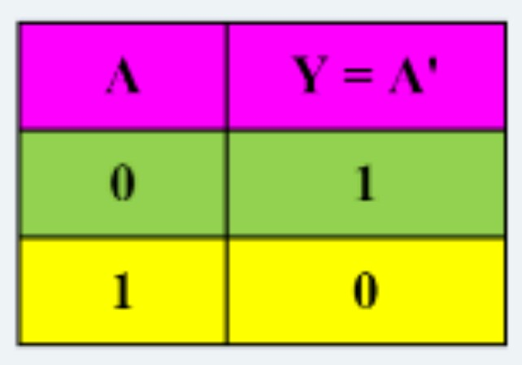
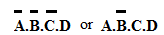
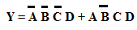
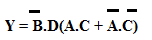
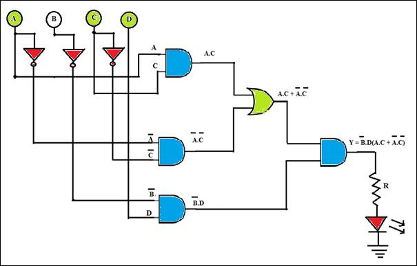

1   INTRODUCTION

A typical travel suitcase/bag is provided with a 3-digit or a 4-digit security code lock that unlocks for only a predefined combination of these digits. An electronic lock is a digital combinational circuit that is analogous to the travel suitcase code lock. An electronic lock opens (output goes high) only for certain combinations of the digital inputs. For a 3-digit code lock, there would be in all 2^3 i.e. 8 combinations whereas for a 4-digit there would be 2^4 i.e. 16 combinations of the input. In this experiment, the design steps for a 4-digit electronic lock that operates for two code combinations are explained. Based on the user’s need an electronic code lock can be designed so as to operate with multiple combinations of inputs using basic logic gates. Moreover, the lock can be made more secure by increasing the number of digits.

1.1 CONCEPT:

The electronic lock is designed with four inputs ABCD. A HIGH output will open the lock and the LED turns ON. Let us consider that two combinations of input switches (0001 or 1011) generate a 1(HIGH) at the output and opens the lock.

2 DESIGN STEPS

1. Prepare a truth table with A, B, C and D as four inputs resulting in 16 possible combinations (optional).

2. Convert the truth table information into a Boolean expression. Form the Minterm Boolean expression for the electronic lock circuit.

**Truth Table**  

From the truth table, only two of the sixteen possible combinations of inputs A, B, C and D generate a logical 1 at the output. The two combinations that open the lock are   
    
When these two combinations are ORed together they result in a Boolean expression for this application. Minterm Minterm Boolean expression for electronic lock:  
    
With a view to use two-input gates, the expression can be rearranged as:  
    
3. Convert the Boolean expression to logic diagram as shown in Fig.1.  
  

Figure1. Electronic Lock    
4. Turn ON/OFF the ABCD input combination as shown in the truth table.

8. Observe for what combination of input, the output goes high and the lock opens and thus validate the design.
